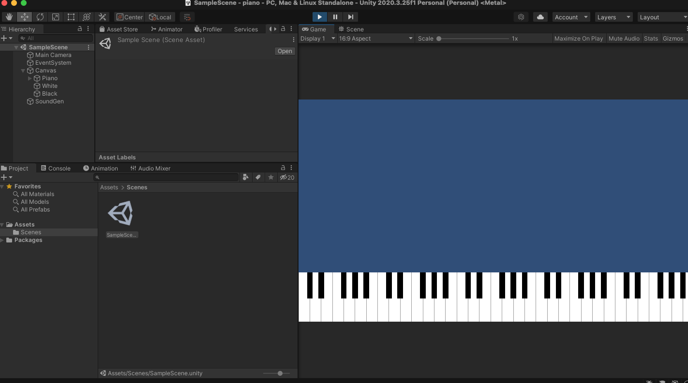

# Piano for Unity
Just open the sample scene, click start and play piano!

I also made a Youtube tutorial on how to create this, check it out here: [Create Piano in Unity](https://youtu.be/K4dKsIJnh1c)